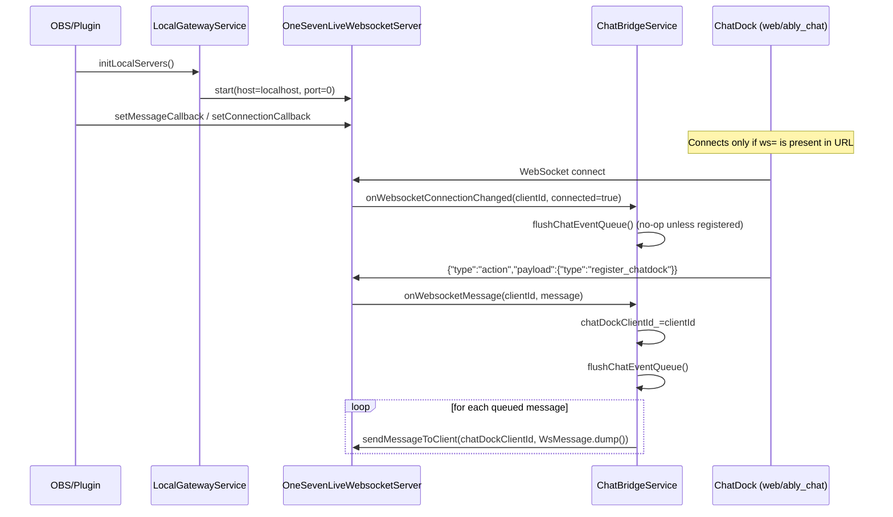
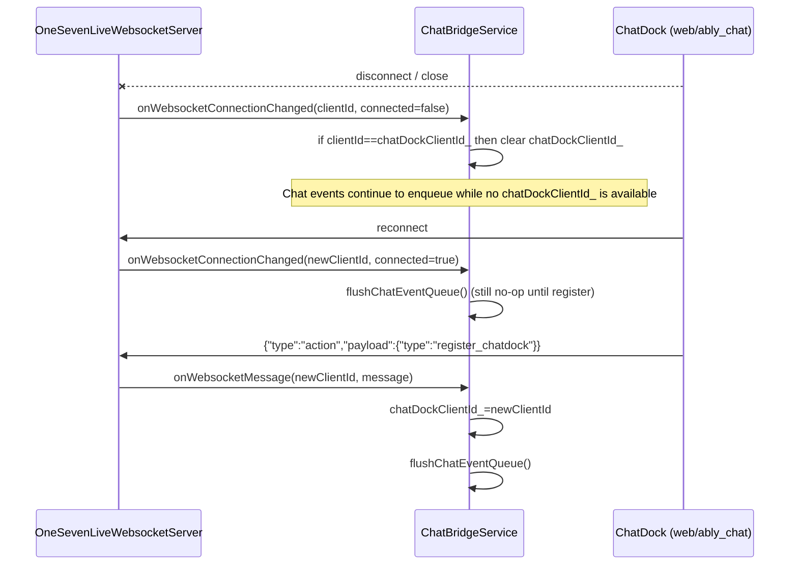

# Local Gateway + Chat Bridge

This document describes how the plugin wires the local WebSocket server to the ChatDock frontend,
including registration, disconnect cleanup, and queued event flush behavior.

References:

- Protocol: [local-protocol.md](file:///Users/zhuyu/workspace/mk/17live/dev/obs-17live/docs/local-protocol.md)
- Wiring: [OneSevenLiveCoreManager.cpp](file:///Users/zhuyu/workspace/mk/17live/dev/obs-17live/src/17live/OneSevenLiveCoreManager.cpp)
- Server: [OneSevenLiveWebsocketServer.cpp](file:///Users/zhuyu/workspace/mk/17live/dev/obs-17live/src/17live/websocket/OneSevenLiveWebsocketServer.cpp)
- Bridge: [ChatBridgeService.cpp](file:///Users/zhuyu/workspace/mk/17live/dev/obs-17live/src/17live/core/ChatBridgeService.cpp)

## Sequence (Register + Flush)

## Sequence (Disconnect + Reconnect + Flush)

## Regression Focus

- Disconnect cleanup: chatDockClientId_ is cleared only when the registered client disconnects.
- Reconnect behavior: connection alone does not register; register message is required.
- Queue semantics:
  - When not registered, events are enqueued up to a max size and older items drop first.
  - When registered, events are sent directly and queue drains on flush.

